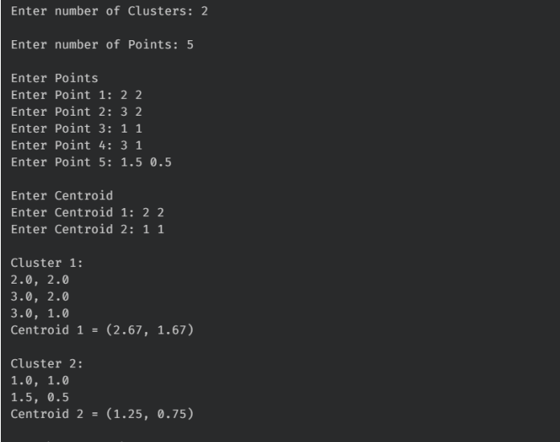
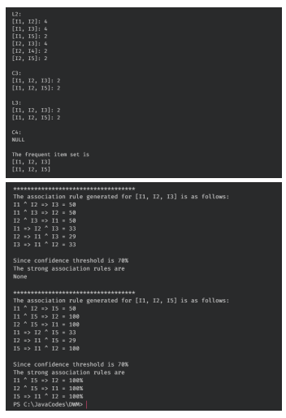
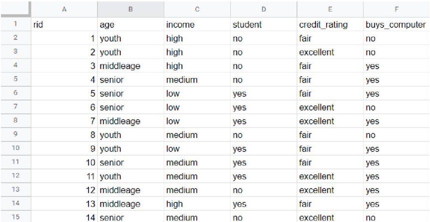

https://bit.ly/if-staymail
https://www.protectedtext.com/4-5-6

#----------------------------------------------datavisualization

import matplotlib.pyplot as plt
values = list(map(int,input("Enter Data:").split()))
Xrange = [ i for i in range(int(input('Start X:')),int(input('End X: '))+1)]
Yrange = [ i for i in range(int(input('Start Y:')),int(input('End Y: '))+1)]
Xleave = int(input('Enter distance between X scale: '))
Yleave = int(input('Enter distance between Y scale: '))
plt.hist(values)
plt.xticks(Xrange[::Xleave])
plt.yticks(Yrange[::Yleave])
plt.title("Experiment 5")
plt.xlabel("Value Groups")
plt.ylabel("Frequency")
#plt.savefig("hist.png")
plt.show()

#--------------------------------------------kmean1d

#--------------------------------------------kmean2d

#--------------------------------------------apriori

#------------------------Bayesian

